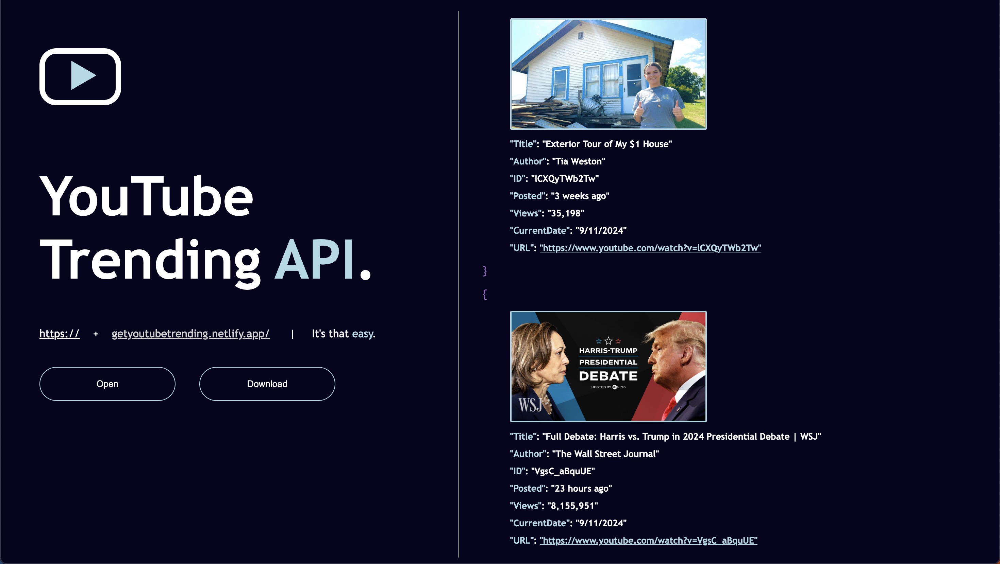

## Update: This app / web scraper is tedious to maitain and I've since stopped... well, maintaining it. 😅
> But, maybe the code is still interesting to you and you'd still like to see how it *used to work! 



*GET* data from <a href="https://www.youtube.com/trending" target="_blank">youtube/trending</a>

## 🗣️

YouTube updates their list of trending videos every 15 minutes. And with each update, videos could remain in the same position or move up and down the trending list. Data is made available at [getyoutubetrending.netlify.app/](https://getyoutubetrending.netlify.app/). This link returns a list of all (100~ ... YouTube fluctuates) trending youtube videos, and meta data including the time passed since each was uploaded, their current view count, title, author, etc.

Although rankings change every 15 minutes, views,  for example, update every few minutes. When this happens, the list will also update to reflect.

---

|🤔|🧠|
|-|-|
|How does it work?|The data is procured through [web scraping](https://en.wikipedia.org/wiki/Web_scraping). One request is made to retrieve the HTML body of [youtube.com/trending](https://www.youtube.com/trending), and each data point (title, author, view count) is parsed individually, allowing logic to be improved in isolation, and for each data point to be tested individually.
|What's available?| Currently, there is only one list that serves data from all of [youtube.com/trending](https://www.youtube.com/trending)'s youtube videos. Plans to curate other lists (categories, tracking metrics, rate of change etc.) TBD.|
|How do I get it?|Download as CSV [here](https://getyoutubetrending.netlify.app?page=landing). You can also open [this link](https://getyoutubetrending.netlify.app/) in your web browser, or (*GET*) it using the HTTP client of your choosing.

## Code Examples
### axios

```js
const axios = require('axios')

axios.get('getyoutubetrending.netlify.app/')
  .catch(error => console.log(error));
```

### node-fetch (v2)
    npm install node-fetch@2
```js
const fetch = require('node-fetch')

fetch('https://getyoutubetrending.netlify.app')
  .then(res => res.json())
  .then(data => data)
  .catch(error => console.log(error));
```
