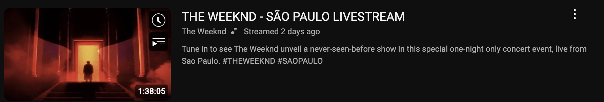
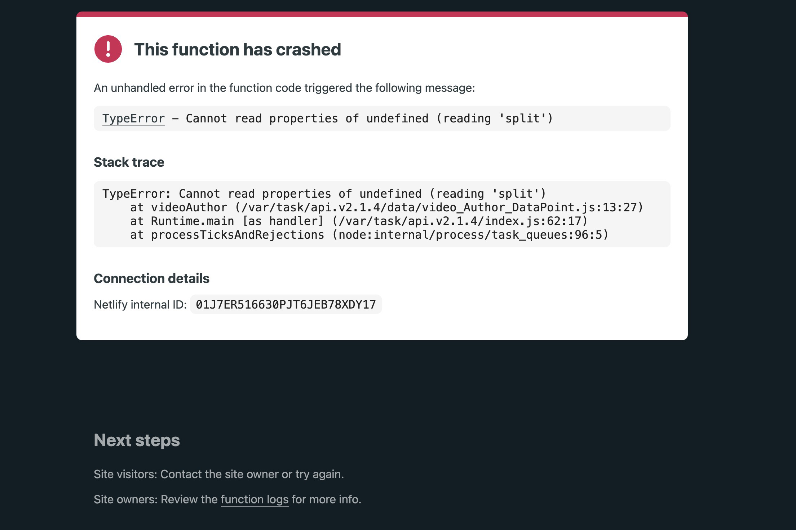

--09/09/24-- Author, View Count parses broken:

issue:

Streams do not have view counts:


-- Example below: ***"Streamed 2 days ago"***




The author parser shares the same logic as view counts, so that broke too.



fix
```js
// oldAuthor
module.exports = {
    videoAuthor: function(body, i, title){
        let videoIds = body.split(`"watchEndpoint":{"videoId":"`) // "}],"accessibility":{"accessibilityData":{"label":"
            videoIds.shift()
        let videoId = videoIds[i].split(`"}],"accessibility":{"accessibilityData":{"label":"`)[1].slice(0,200)
            id = videoId
        let ago = id.lastIndexOf("ago")
        let str = id.split(`"}}},"descriptionSnippet":{"runs":[{"text":"`)[0].slice(0, ago).split(" ")
        str.pop();str.pop();str.pop();
        let d = str.join(" ").replace(title, '')
            d = d.slice(4,d.length)
        d =  d.split(' views')
        c = d[d.length-2].split(" ") // <-------- noticed the first element was consistently what I needed. So instead of trying to point to the second to last element of an array, the array is always 2 elements. Both parsers now just take the first.
        c.pop()
        c = c.join(" ")
        return c
    }
}
// newAuthor
module.exports = {
    videoAuthor: function(body, i, title){
        let videoIds = body.split(`"watchEndpoint":{"videoId":"`) // "}],"accessibility":{"accessibilityData":{"label":"
            videoIds.shift()
        let videoId = videoIds[i].split(`"}],"accessibility":{"accessibilityData":{"label":"`)[1].slice(0,200)
            id = videoId
        let ago = id.lastIndexOf("ago")
        let str = id.split(`"}}},"descriptionSnippet":{"runs":[{"text":"`)[0].slice(0, ago).split(" ")
        str.pop();str.pop();str.pop();
        let d = str.join(" ").replace(title, '')
            d = d.slice(4,d.length)
        d =  d.split(' views')
        d = d[0].split(" ") // ---- here
        d.pop()
        d = d.join(" ")
        return d
    }
}
```


```js

// oldViewCount
module.exports = {
    videoAuthor: function(body, i, title){
        let videoIds = body.split(`"watchEndpoint":{"videoId":"`)
            videoIds.shift()
        let videoId = videoIds[i].split(`"}],"accessibility":{"accessibilityData":{"label":"`)[1].slice(0,200)
            id = videoId
        let ago = id.lastIndexOf("ago")
        let str = id.split(`"}}},"descriptionSnippet":{"runs":[{"text":"`)[0].slice(0, ago).split(" ")
        str.pop();str.pop();str.pop();
        let d = str.join(" ").replace(title, '')
            d = d.slice(4,d.length)
        d =  d.split(' views')
        c = d[d.length-2].split(" ") // ---- here
        c.pop()
        c = c.join(" ")
        return c
    }
}
// newViewCount
module.exports = {
    videoAuthor: function(body, i, title){
        let videoIds = body.split(`"watchEndpoint":{"videoId":"`)
            videoIds.shift()
        let videoId = videoIds[i].split(`"}],"accessibility":{"accessibilityData":{"label":"`)[1].slice(0,200)
            id = videoId
        let ago = id.lastIndexOf("ago")
        let str = id.split(`"}}},"descriptionSnippet":{"runs":[{"text":"`)[0].slice(0, ago).split(" ")
        str.pop();str.pop();str.pop();
        let d = str.join(" ").replace(title, '')
            d = d.slice(4,d.length)
        d =  d.split(' views')
        d = d[0].split(" ") /// ---- here
        d.pop()
        d = d.join(" ")
        return d
    }
}
```
